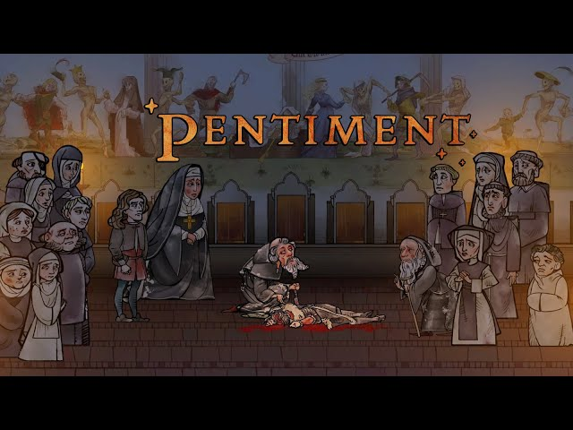

*This schedule is subject to change; any alterations will appear here and be announced in class.*

## Week 1-2 (08.26-09.04): Introduction to Game Studies and Its Scope

- Definition of game studies as an interdisciplinary field
- Historical context and evolution of games
- Understanding the importance of games in modern society
- Overview of key concepts: ludology, narratology, gameplay, mechanics, aesthetics

  ### Week 1: Introduction to Game Studies: What is "Play"?

  BUY THE FOLLOWING BOOKS:
- [Homo Ludens: A Study of the Play Element in Culture, Johan Huizinga](https://a.co/d/fCo6jf3)
- [Play Matters, Miguel Sicart](https://a.co/d/1EEDF8p)
  
  readings:
  - [Miguel Sicart, "Play Is," in Play Matters (MIT Press, 2014)](readings/sicart_playmatters_1.pdf)
  - [Johann Huizinga, "Nature and Significance of Play as a Cultural Phenomenon," in Homo Ludens (Routledge, 1944) pgs 1-15](readings/huizinga_homoludens_1.pdf)
  
  lecture:
  - [Week 1: 08.28](readings/130_wk1_F24.pdf)

  ### Week 2: Games as Artifacts: Historical Games and Their Relationships to Scientific Disciplines, Cultures, and Social Structures
  readings:
  - [Johann Huizinga, "Play Concept as Expressed in Language," in Homo Ludens (Routledge, 1944) pgs 28-45](readings/huizinga_homoludens_2.pdf)
  - [Claude Shannon, "A Chess-Playing Machine," Scientific American, 1950](readings/shannon_chess1950.pdf)

  lecture:
  - [Week 2: 09.02](readings/130_wk2_F.pdf)
 
  game:
  - [Everyone is John](readings/eij_v2_2024.pdf)

## Week 3-4 (09.09-09.18): The Historical, Cultural, and Social Significance of Games  

- Early forms of play and games
- Cultural analysis of games
- Representation in games: gender, ethnicity, and diversity
- Impact of games on social interactions and relationships
- Online communities and multiplayer dynamics  

- assignment (Due end of Week 4): [Game Analysis Presentation](ASSIGNMENTS.md)  

  ### Week 3: Why Play Games? What Do Games Do?  
  readings:
  - [Johann Huizinga, "Play Concept as Expressed in Language," in Homo Ludens (Routledge, 1944) pgs 28-45](readings/huizinga_homoludens_2.pdf)
  - [Miguel Sicart, "Playfulness," in Play Matters (MIT Press, 2014)](readings/sicart_playmatters_2.pdf)  

  lecture:
  - [Week 3: 09.09 & 09.11](readings/130_Week_03_F24.pdf)

  game:
  - [The Quiet Year TTRPG](readings/The_Quiet_Year_PDF.pdf)
  
  ### Week 4: Representation in Games and Why It Matters
  readings:
  - ["The Dungeons & Dragons Players of Death Row," The New York Times Magazine, Keri Blakinger, Aug. 31, 2023](readings/nyt_dnd_deathrow.pdf)
  - [Tanya Depass interview](https://www.youtube.com/live/H-YeiDnEl8E?si=zdhseZw_jLAZjTsS)
  - [Into the Motherlands RPG](https://cypheroftyr.com/into-the-mother-lands-a-new-sci-fi-odyssey/)
  - [I Need Diverse Games Patreon](https://www.patreon.com/INeedDivGms)  

  lecture:
  - [Week 4: 09.16](readings/130_Week_04_F24.pdf)
  
  assignment: GAME ANALYSIS PRESENTATIONS DUE 09.18
  
## Week 5-6 (09.23-10.02): Game Construction and Development Principles

- Exploring fundamental game design principles
- Player experience and inclusivity/access
- Balance, challenge, and reward systems
- Game mechanics and dynamics
- Playtesting and iterative design

  ### Week 5: Non-linear narrative games & interactivity
  readings:
  - [Merritt Kopa, Videogames for People, Introduction (pp. 5-19)](readings/merritt-kopa-videogames-for-humans-twine-authors-in-conversation.pdf)
 
  Assignment (due at the end of Week 6, 10.02):
  - [Twine_Game](ASSIGNMENTS.md)
  - Harlowe Manual: https://twine2.neocities.org/
  - [Template for Twine Macros](readings/Macro_Madness.html)

  reading guide:
  - [Week 5: 09.23 & 09.25](readings/130_Week_05_F24.pdf)

  ### Week 6: More about interactivity and game mechanics
  reading:
  - [Edwards, Benj (April 4, 2017). "The Forgotten World of Teletype Computer Games". PC Magazine.](https://www.pcmag.com/news/the-forgotten-world-of-teletype-computer-games)
  - [Jerz, Dennis (2007). "Somewhere Nearby is Colossal Cave: Examining Will Crowther's Original "Adventure" in Code and in Kentucky". Digital Humanities Quarterly. 1 (2).](http://www.digitalhumanities.org/dhq/vol/001/2/000009/000009.html)

  video:
  - Get Lamp: The Text Adventure Documentary: https://www.youtube.com/watch?v=LRhbcDzbGSU
    note: The beginning is a short presentation by the filmmaker. Documentary starts at 6:00, ends at 1:38.
 
  ### ASSIGNMENT #2 - TWINE GAME - DUE 10.02!

  ## Week 7-8 (10.07-10.16): Serious Games and Gamification
- Understanding gamification and its applications
- Gamification in education, healthcare, and business
- Designing games for non-entertainment purposes
- Ethics and considerations in applied game design
- Introduction to Game Theory principles

  ### Week 7: Serious Games
  
  watch:
  - Serious Games I-IV, Harun Farocki: https://vimeo.com/370494311
 
  reading:
  - Miguel Sicart, "Politics," in Play Matters (MIT Press, 2014): pgs. 71-81
 
  ### Week 8: Gamification and Meaningful Interactivity

   reading:
  - Miguel Sicart, "Toys," and "Playgrounds" in Play Matters (MIT Press, 2014)
  - ["Seven Ways of Misunderstanding Interactive Art," Erkkhi Huhtamo, 1995](readings/huhtamo_interactive_art.pdf)
  - ["Meaningful Play" and "Interactivity" in Rules of Play: Game Design Fundamentals, Katie Salen and Eric Zimmerman](readings/rules-of-play.pdf)
 
  ### ASSIGNMENT #3: TWO/THREE COLOR GAME ASSIGNMENT, Due: 10/28
  - https://github.com/UICIDEAS/IDEA_130_F25/blob/main/ASSIGNMENTS.md

## Week 9-10 (10.21-10.30): Game Creation Methods
- Game development processes and stages
- Introduction to game engines and tools
- Conceptualization and prototyping
- Art and sound design in games

  ### Week 9: Meaningful Interactivity
  lecture:
  - [Week 9: 10.21](readings/130_Week_09.pdf)
 
  readings:
  - ["Seven Ways of Misunderstanding Interactive Art," Erkkhi Huhtamo, 1995](readings/huhtamo_interactive_art.pdf)
  - ["Meaningful Play" and "Interactivity" in Rules of Play: Game Design Fundamentals, Katie Salen and Eric Zimmerman](readings/rules-of-play.pdf) 

  ### Week 10: Going Solo!

Assignment: SOLO TTRPG: https://github.com/UICIDEAS/IDEA_130_F25/blob/main/ASSIGNMENTS.md#solo-ttrpg-table-top-role-playing-game-assignment-due-thursday-november-7th
  
  - Access the [SOLO TTRPG FOLDER](readings/solottrpg)
  - Play two or more, saving your journals.
  - Create a solo TTRPG! (Due Nov. 6th!)

## Week 11-12 (11.04-11.13): Game Theory and Game Dev

  - simple intro to some Game Theory concepts, its use and limitations
  - linking Game Theory and Game Studies as disciplines
  - Thinking through Game Theory general concepts and usage in Game Dev
    
### Week 11: Intro to Game Theory - Game Theory for Games Developers (and how it relates to Game Studies)
  
- Reading in class: Binmore Introduction to Game Theory: https://github.com/UICIDEAS/IDEA_130_F25/blob/main/readings/binmore-game-theory.pdf
-  Solo TTRPG due: November 6th!

### Week 12: Choosing the Right Tools - Final Project Introduction

Assignment: FINAL PROJECT: https://github.com/UICIDEAS/IDEA_130_F25/blob/main/ASSIGNMENTS.md#final-game-project-proposals-due-thursday-november-14th-final-due-tuesday-december-3rd

## Week 13-14 (11.18-11.25): Emerging Technologies and Future Trends
- Exploration of virtual reality (VR) and augmented reality (AR) in games
- Impact of artificial intelligence (AI) on game design
- Ethical considerations in game development and consumption
- Speculating on the future of game studies and the gaming industry

## THANKSGIVING BREAK (11/26-11/28)

## Week 15 (12.02-12.04): Building Communities in Video Games

#### Final Game Project (due: Dec 2nd)

  - See "Assignments" for instructions.

### Week 15: Game Communities

#### GAME/CREATING CODING COMMUNITIES:

- https://vgagallery.org/
- https://bitbashchicago.com/
- https://itch.io/
- https://borogove.io/ (for Twine games)
- https://play.date/pulp/ (for Playdate/Pulp games)
- https://processingfoundation.org/ (general creative coding organization)

#### For IRL gaming:

- https://bitbashchicago.com/
- https://www.chicagolandgames.com/
- https://www.meetup.com/chicago-queer-gaming-society/

#### Locations that host RPG events:

- Marz Brewing (Level Eater events): https://marz.beer/
- Whiner Beer (Wizards ands Whiners): https://www.whinerbeer.com/
- Prism Games: https://www.prismgameschicago.com
- Tangible Books: https://tangiblebookschicago.com/

