# Twine Tips and Tricks
https://twine2.neocities.org/  
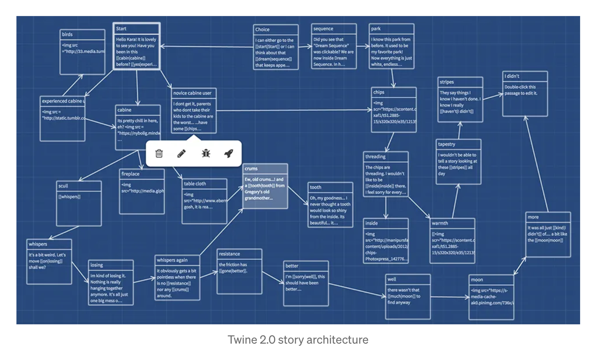  

These are a few helpful tips and tricks for building your Twine game. The most basic part of making a text adventure is linking passages to one another. The syntax looks like this:

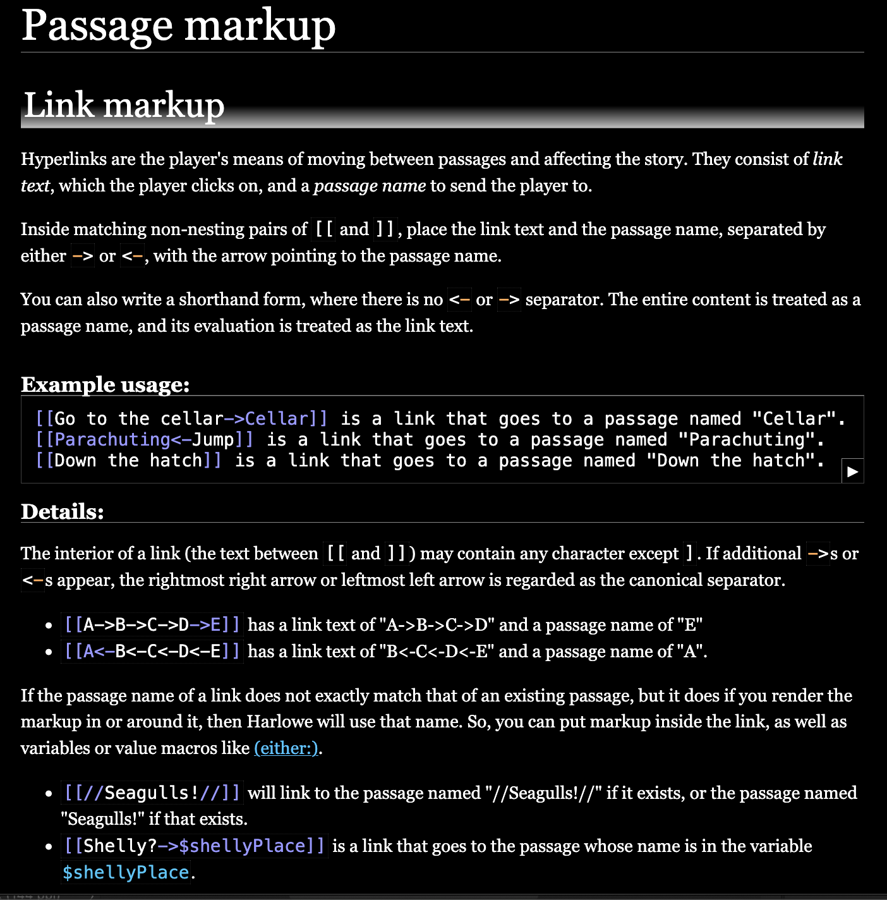  

Styling your text might also add to the flavor of your game.

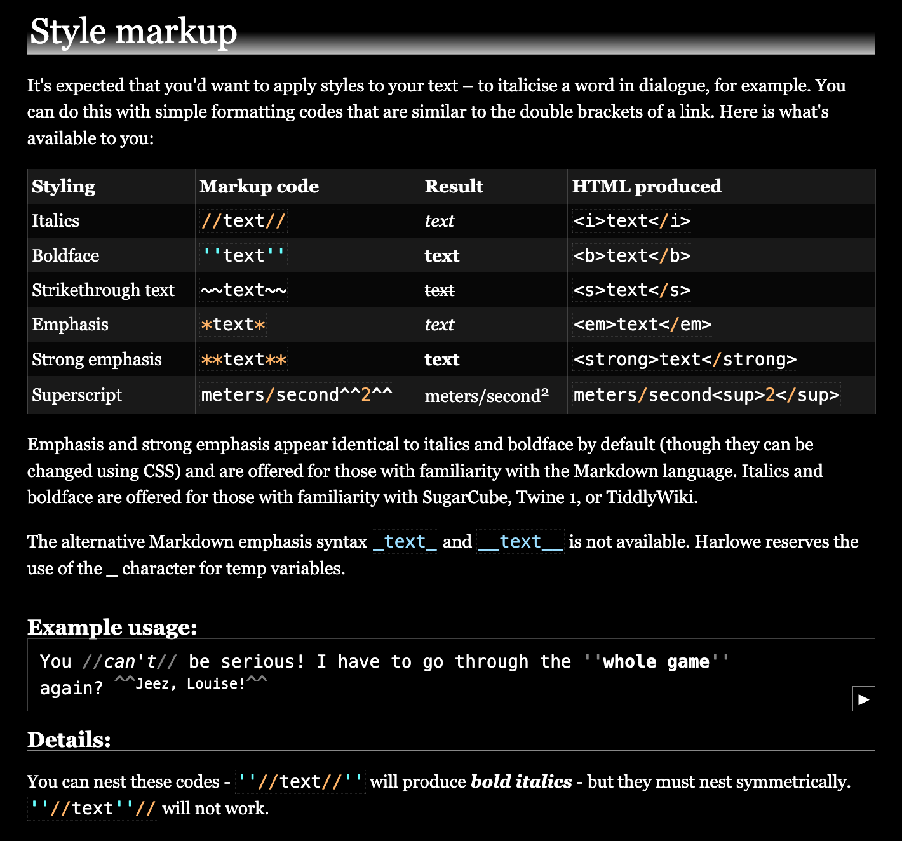  
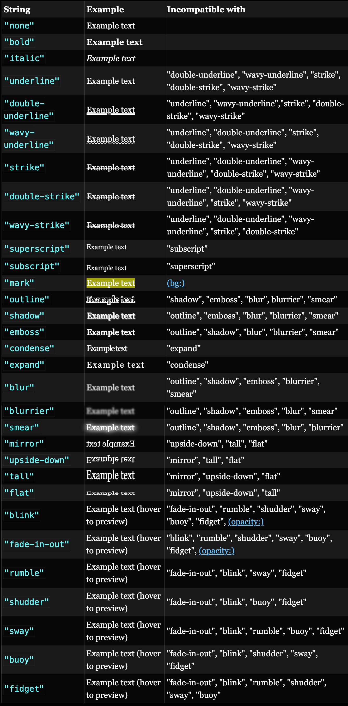  

You can also change the way one passage transitions to another.

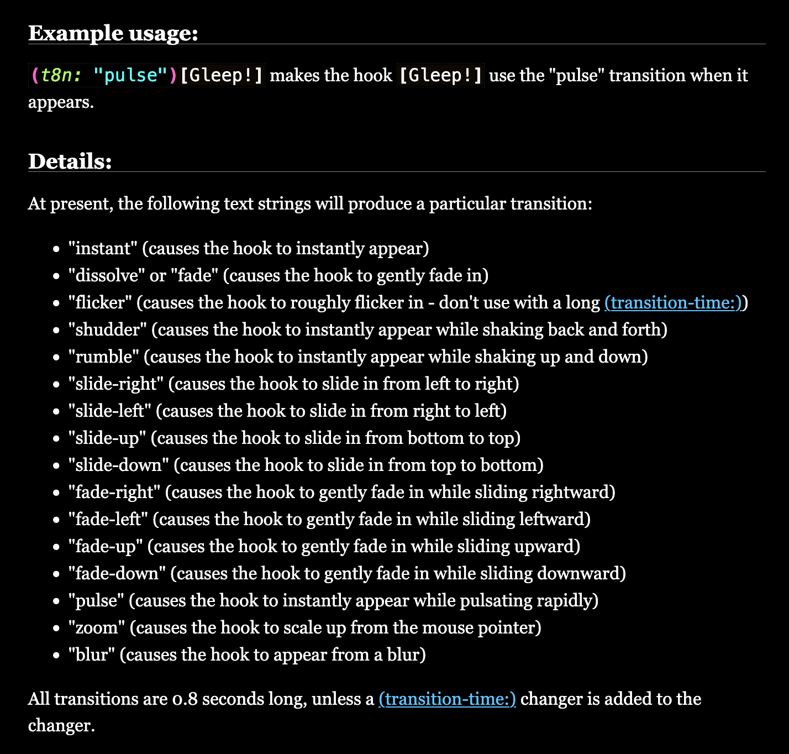  

While the functionality of building a text adventure game is mostly in linking one passage to the next, you can create things like variables and branching sequences (conditionals) that change the nature of your game. 

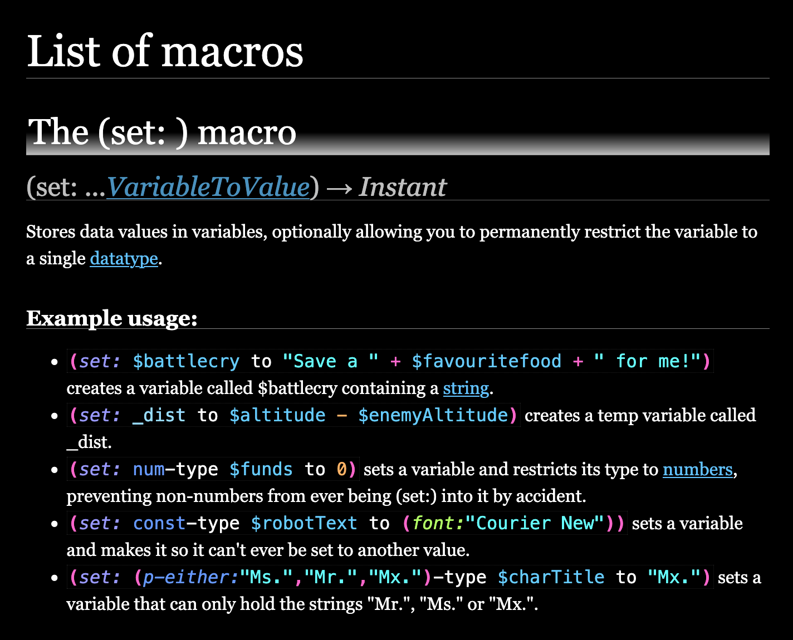  
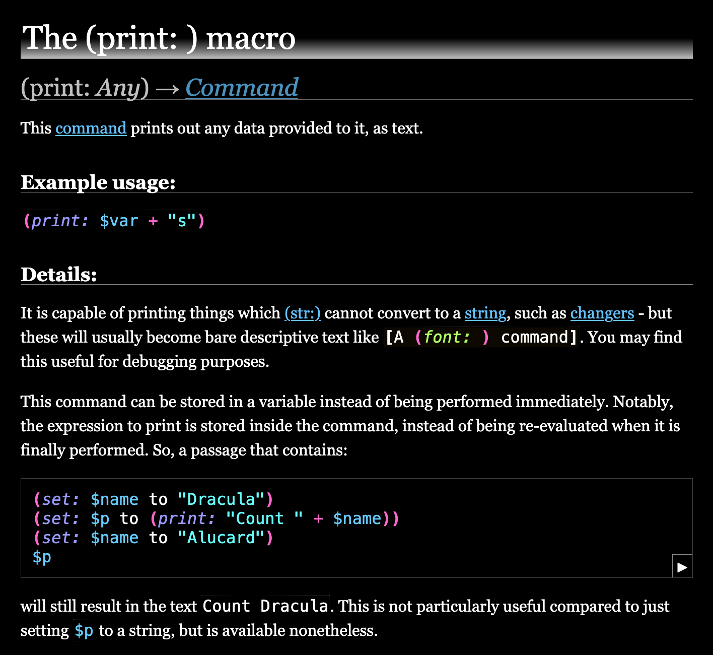  
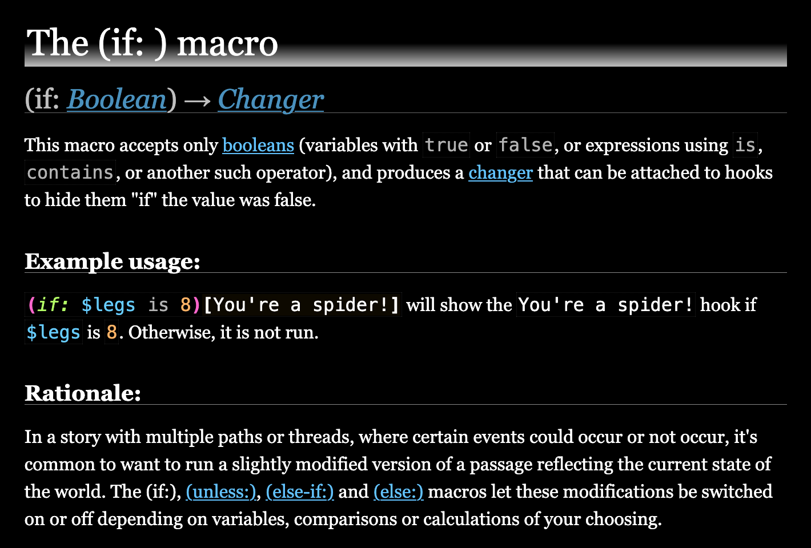  
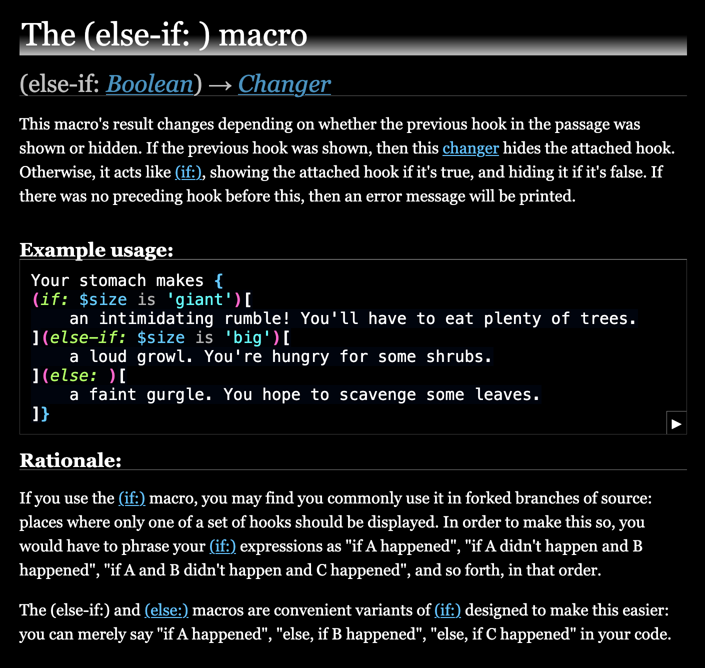  
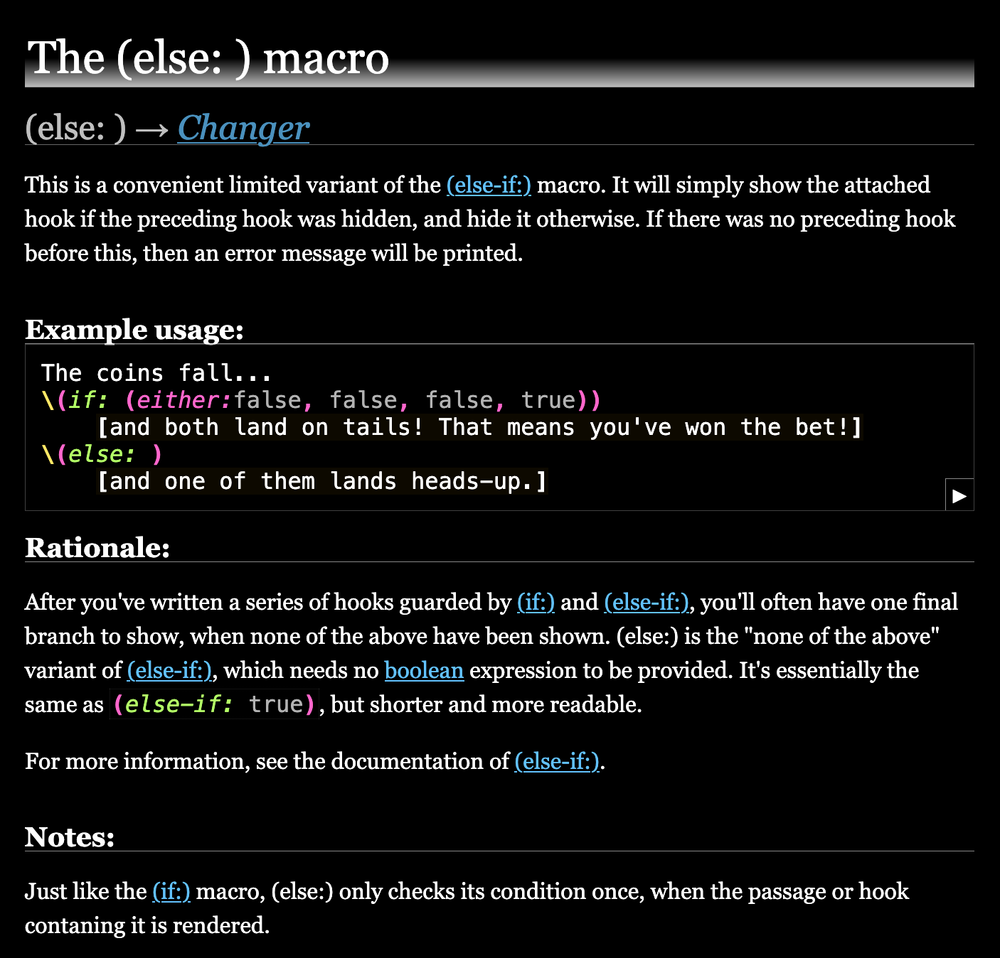  

If you have skills in HTML, you can use that syntax right in the TWINE passages as well.

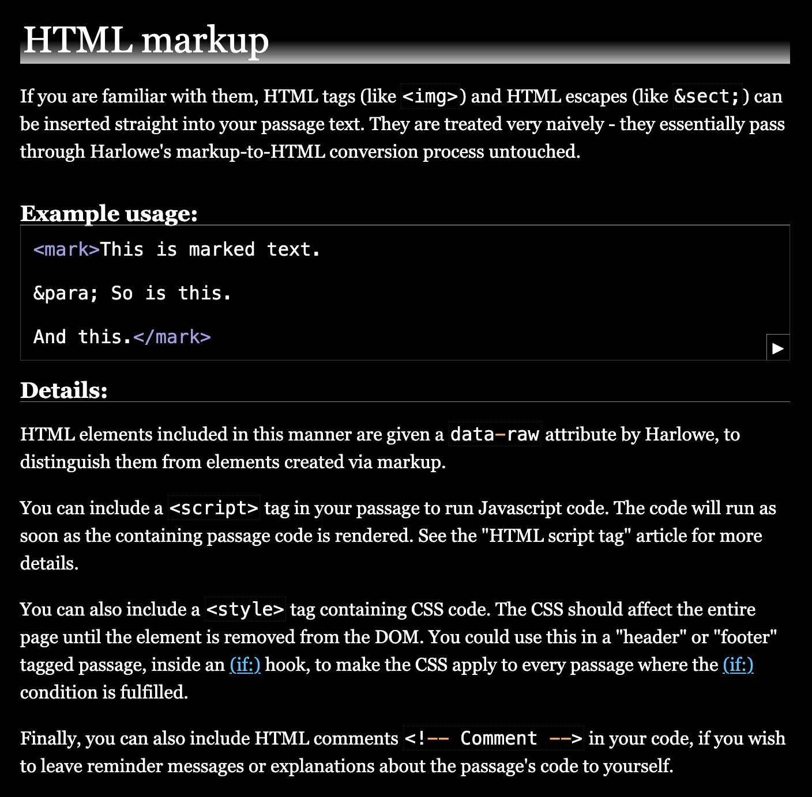  

